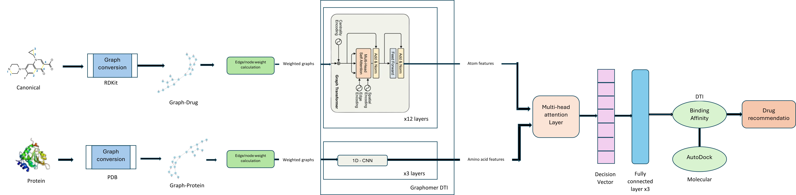
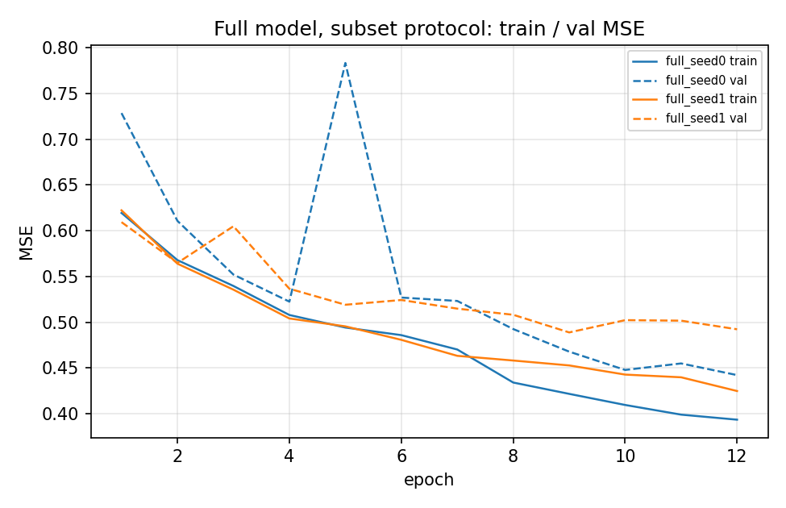
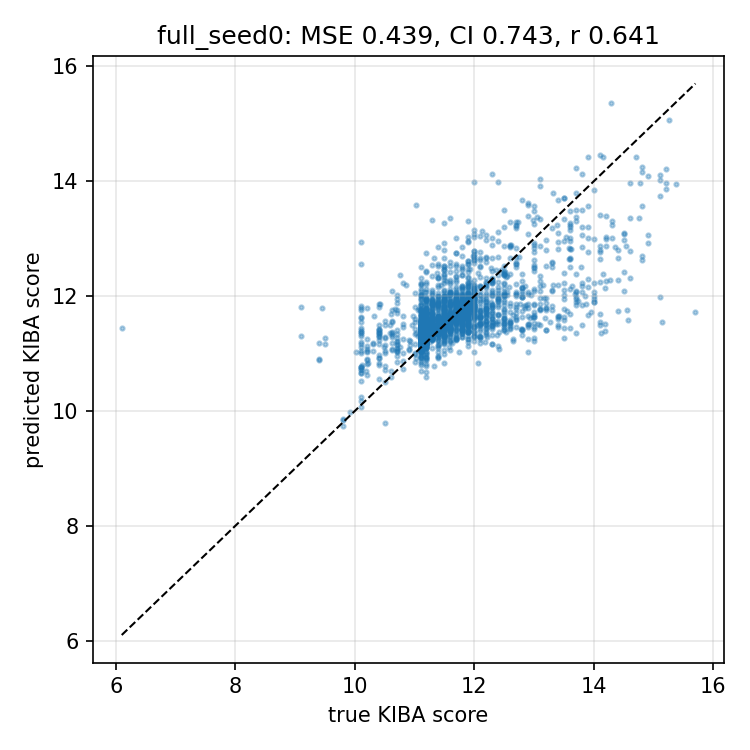
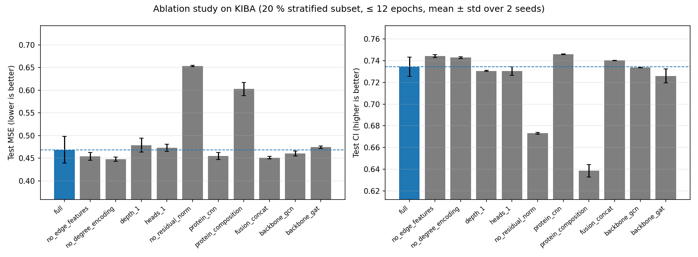
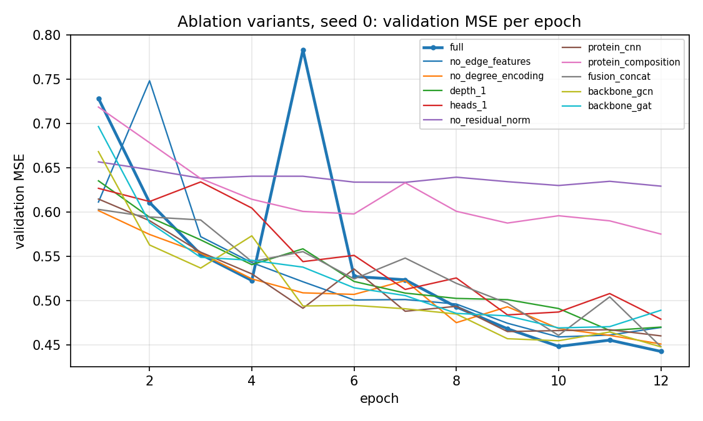

# Phase 1 — Drug–Target Binding-Affinity Prediction on KIBA with an Edge-Aware Graph Transformer

[](#installation)
[](#installation)
[](#tests)

Phase 1 of a two-phase thesis on graph-transformer models for drug discovery
(December 2024 AUIST report; GitHub `phase1/` ↔ that PDF). This package predicts the
**KIBA binding-affinity score** of a drug–kinase pair from (i) the drug's molecular graph and (ii) the target's
amino-acid sequence. Drugs are encoded with an **edge-aware graph transformer** (bond-feature-biased sparse
attention, Graphormer-style degree encoding, residual + BatchNorm blocks) adapted from
[GraphormerDTI](https://github.com/mengmeng34/GraphormerDTI); proteins are encoded with frozen
**ProtBERT-BFD** embeddings (or a learned 1-D CNN); the two are fused with **protein-conditioned
cross-attention over atoms** and regressed by a 3-layer MLP. Every architectural component is a configuration
flag, which is what makes the [ablation study](#ablation-study) below possible.

> **TL;DR** — from-scratch, DGL-free re-implementation of the research notebooks with the bugs fixed
> (see [CHANGELOG.md](CHANGELOG.md); most importantly the original ProtBERT embeddings were identical for all
> 229 targets). Under the fixed ablation protocol (20 % stratified subset of KIBA, 18,826 training pairs, ≤ 12 epochs,
> 2 seeds) the full model reaches **test MSE 0.4684 ± 0.0296 / CI 0.7343 ± 0.0088 / r_m² 0.3625 ± 0.0416** in **5.4 min**
> per run on a GTX 1650 Ti (4 GB). Residuals + BatchNorm and a real protein representation matter most;
> bond features, degree encoding and cross-attention fusion did not help under this budget, and a 0.68 M GCN
> backbone is competitive. The full-KIBA configuration (`configs/default.yaml`) is provided but was not run
> for this release (see [Results](#results)).

<p align="center">
  
  <br><em>Thesis architecture (Phase 1 + Phase 2 overview). Phase 1 implements the drug branch (RDKit graph →
  graph transformer), the protein branch (sequence embedding), the multi-head attention fusion and the
  fully-connected affinity head. The released default uses 4 transformer layers instead of the 12 drawn.</em>
</p>

---

## Contents

1. [Task and data](#task-and-data)
2. [Model](#model)
3. [Installation](#installation)
4. [Quick start](#quick-start)
5. [Results](#results)
6. [Ablation study](#ablation-study)
7. [Hyper-parameters](#hyper-parameters)
8. [Project structure](#project-structure)
9. [Reproducibility](#reproducibility)
10. [Tests](#tests)
11. [Citation](#citation), [License](#license), [Acknowledgements](#acknowledgements)

---

## Task and data

| | |
|---|---|
| **Task** | Regression of the continuous KIBA score (higher = stronger binding; range 0–17.2, mean 11.72, std 0.83). Reported metrics follow DeepDTA/GraphDTA: **MSE ↓, CI ↑ (concordance index), r_m² ↑**, plus RMSE, MAE, Pearson, Spearman and AUROC/AUPRC after binarising at the conventional threshold 12.1. |
| **Dataset** | [KIBA](https://doi.org/10.1021/ci400709d) (Tang et al. 2014) in the DeepDTA/TDC benchmark form: **117,657 pairs, 2,068 drugs (SMILES), 229 kinase targets (sequences)**. Obtained from Therapeutics Data Commons — `python scripts/download_kiba.py` fetches the TDC copy from Harvard Dataverse; a 1 MB compact copy is versioned in `data/kiba/` so the repo trains out of the box. Details in [`data/README.md`](data/README.md). |
| **Split** | Random *pair-level* split 80 / 10 / 10 (94,125 / 11,766 / 11,766), seed 42, indices versioned in `data/splits/kiba_random_seed42/`. |
| **Ablation subset** | Stratified 20 % subset (23,532 pairs, 10 quantile bins of y) → 18,826 / 2,353 / 2,353, seed 42, `data/splits/kiba_subset20_seed42/`. Fixed budget for *every* variant including the full model: batch 128, ≤ 12 epochs, early stopping (patience 4) on validation MSE, 2 seeds, one run at a time on a 4 GB GPU (`configs/ablation/_base.yaml`). |
| **Preprocessing** | RDKit → categorical atom (8) and bond (3) features, bidirectional edges, degree tensor; protein → frozen ProtBERT-BFD mean-pooled embedding (`[229, 1024]`, shipped) or residue tokens (≤ 1,000) or composition vector. |

## Model

```
SMILES ──RDKit──▶ atom/bond categorical features ──▶ Σ embeddings (+ degree embedding)
                                                       │
                                     ┌─────────────────▼──────────────────┐
                                     │  L × Graph-Transformer block         │
                                     │   sparse MHA over bonds + self-loops │
                                     │   logits += W_e · bond embedding     │  ← use_edge_features
                                     │   O_h / O_e → residual → BatchNorm   │  ← residual / norm
                                     │   FFN(h), FFN(e) → residual → BN     │
                                     └─────────────────┬──────────────────┘
                                                       │ atom embeddings h ∈ ℝ^{N×d}
sequence ──ProtBERT-BFD (frozen)──▶ 1024-d ──MLP──▶ p ∈ ℝ^d
                                                       │
            cross-attention: query = p, keys/values = atoms of the same molecule (masked)
            z = [ attn(p, h) ‖ mean-pool(h) ‖ p ]      ← fusion = cross_attention | concat | add
                                                       │
                              3-layer MLP (LeakyReLU, dropout) → ŷ (z-scored KIBA, de-standardised for metrics)
```

* **Drug encoder** — `GraphTransformerEncoder` (`src/dti_gt/models/graph_transformer.py`): the edge-augmented graph
  transformer of Dwivedi & Bresson as used in GraphormerDTI, re-implemented with PyTorch Geometric primitives
  (`torch_geometric.utils.softmax` per destination node, `scatter` aggregation). Alternatives via `model.backbone`:
  `gcn`, `gat`, `gine`.
* **Protein encoder** — `pretrained` (ProtBERT-BFD → LayerNorm → MLP), `cnn` (embedding + Conv1d k = 4/8/12 + max-pool,
  DeepDTA-style), `composition` (bag-of-residues MLP).
* **Fusion** — `cross_attention` (default), `concat`, `add`.
* Default size: d = 128, 4 layers, 8 heads → 1.54 M trainable parameters.

## Installation

Tested on Windows 11 / Python 3.12.3 / PyTorch 2.5.1 + CUDA 12.1 / RDKit 2024.03.5 / PyG 2.6.1 (GTX 1650 Ti, 4 GB / 16 GB RAM).
Linux/macOS work the same (replace the venv activation command). No DGL and no compiled PyG extensions are needed.

```powershell
git clone <repo> && cd <repo>/phase1
python -m venv .venv && .\.venv\Scripts\Activate.ps1          # Linux/macOS: source .venv/bin/activate
pip install torch==2.5.1 --index-url https://download.pytorch.org/whl/cu121   # or the CPU / other-CUDA build
pip install -r requirements.txt
pip install -e .                                               # optional; scripts also work without installing
```

A conda alternative is provided in `environment.yml`. The optional `transformers` dependency is only needed to
recompute protein-language-model embeddings.

## Quick start

All commands are run from the `phase1/` directory. Each one was executed end-to-end to produce the numbers in this
README (except the optional full-KIBA train and the 22-run ablation, which are already on disk).

```powershell
# 0) get the raw KIBA table (optional: the 1 MB compact copy in data/kiba/ is used if this is skipped)
python scripts/download_kiba.py                      # or: python scripts/download_kiba.py --from-local path\to\kiba.tab

# 1) preprocess: normalise table, featurise 2,068 SMILES, write splits (≈ 30 s)
#    writes data/processed/drug_graphs.pt (git-ignored, ~12 MB) and refreshes data/kiba/ + data/splits/
python scripts/preprocess.py

# 1b) (optional) recompute protein embeddings with another protein LM (default 0.55 MB npz is already shipped)
python scripts/embed_proteins.py --model Rostlab/prot_bert_bfd --fp16

# 2) train the full model under the ablation protocol (20 % subset, ≈ 5–7 min on a GTX 1650 Ti)
#    → results/runs/full_seed0/  including best.pt (git-ignored; not shipped — regenerate with this command)
python scripts/train.py --config configs/ablation/full.yaml --seed 0
#    full-KIBA training (94k pairs, ≤ 40 epochs, ≈ 1.5–2 h on the same GPU; not run for this release):
#    python scripts/train.py --config configs/default.yaml     → results/runs/full_model_fulldata_seed0/

# 3) run the ablation study (11 variants × 2 seeds, sequential, ≈ 1.8 h) → results/ablation_results.csv + ablation_table.md
python scripts/run_ablation.py --seeds 0 1
#    resumable: finished runs (metrics.json) are skipped and the CSV is rewritten after every run;
#    rebuild the table only:                        python scripts/run_ablation.py --aggregate-only
#    can be sharded over processes:                 python scripts/run_ablation.py --variants full depth_1 --seeds 0 1 --no-aggregate

# 4) evaluate a saved run / summarise all runs, and draw figures
python scripts/evaluate.py --run results/runs/full_seed0            # needs a regenerated best.pt (step 2)
python scripts/evaluate.py --summarize results/runs                 # metrics.json only; no checkpoint required
python scripts/make_figures.py

# 5) tests (CPU, ≈ 20 s)
python -m pytest tests/
```

Useful overrides: `python scripts/train.py --config configs/ablation/full.yaml --seed 3 --set training.epochs=5 training.device=cpu model.num_layers=2`.

## Results

All numbers below are **test-set** metrics on the fixed `kiba_subset20_seed42` split (2,353 pairs), mean ± std
over seeds `{0, 1}`, evaluated from the best-validation-MSE epoch. Protocol: batch 128, ≤ 12 epochs, early
stopping patience 4, AdamW lr 5×10⁻⁴, ReduceLROnPlateau (factor 0.5, patience 2). Hardware: NVIDIA GTX 1650 Ti
(4 GB), 16 GB RAM, Windows 11; 22 runs executed **sequentially** in **1.8 h** wall-clock.

### Full model (`configs/ablation/full.yaml`, 1.54 M parameters)

| | MSE ↓ | RMSE ↓ | MAE ↓ | CI ↑ | r_m² ↑ | Pearson ↑ | Spearman ↑ | AUROC ↑ | AUPRC ↑ |
|---|---|---|---|---|---|---|---|---|---|
| seed 0 (best epoch 12) | 0.4388 | 0.6624 | 0.4374 | 0.7431 | 0.4041 | 0.6405 | 0.6288 | 0.7856 | 0.5979 |
| seed 1 (best epoch 9) | 0.4980 | 0.7057 | 0.4660 | 0.7255 | 0.3209 | 0.5753 | 0.5895 | 0.7660 | 0.5525 |
| **mean ± std** | **0.4684 ± 0.0296** | 0.6841 ± 0.0217 | 0.4517 ± 0.0143 | **0.7343 ± 0.0088** | **0.3625 ± 0.0416** | 0.6079 ± 0.0326 | 0.6091 ± 0.0196 | 0.7758 ± 0.0098 | 0.5752 ± 0.0227 |

Peak GPU memory ≈ **485 MB** at batch 128; ≈ 20–40 s/epoch (the two seeds saw different GPU contention).
Per-run wall time 7.2 min / 3.5 min (mean **5.4 min**).

A naive mean predictor on this split has MSE ≈ Var(y) ≈ 0.69. The full model is clearly above that floor, but
seed 1 is a noticeably worse run than seed 0 (test MSE 0.498 vs 0.439), so **n = 2 is not enough to rank
1–4 % deltas**. See the ablation for the two effects that *are* large and consistent.

The full-KIBA configuration (`configs/default.yaml`: 94,125 training pairs, ≤ 40 epochs) was **not run** for
this release (budget ≈ 1.5–2 h on the same 4 GB GPU). Published DeepDTA/GraphDTA numbers use that larger
regime and are **not comparable** with the subset protocol; the literature table is in
[`results/baseline_comparison.md`](results/baseline_comparison.md) with that caveat written out.

<p align="center">
  
  
  <br><em>Left: full-model train / val MSE on the subset protocol (both seeds). Right: test-set scatter for the
  better full-model seed (seed 0).</em>
</p>

## Ablation study

Eleven variants × two seeds, **identical data, optimiser and epoch budget**. Source table:
[`results/ablation_table.md`](results/ablation_table.md); per-run rows in
[`results/ablation_results.csv`](results/ablation_results.csv). Percentages are relative test-MSE change vs. the
full model.

Protocol: `kiba_subset20_seed42` — train/val/test = 18826/2353/2353 pairs; batch 128, ≤ 12 epochs, early stopping
patience 4 on val MSE, AdamW lr 0.0005; seeds = [0, 1]; best-validation-MSE checkpoint evaluated on the test
split. Values are mean ± std over seeds. Runs were executed sequentially on one GTX 1650 Ti (4 GB).

| Variant | Description | n | MSE ↓ | CI ↑ | r_m² ↑ | Pearson ↑ | AUROC ↑ | Params | Time / run |
|---|---|---|---|---|---|---|---|---|---|
| `full` | Full model (edge-aware GT, 4 layers, 8 heads, degree enc., ProtBERT-BFD, cross-attention fusion) | 2 | 0.4684 ± 0.0296 | 0.7343 ± 0.0088 | 0.3625 ± 0.0416 | 0.6079 ± 0.0326 | 0.7758 ± 0.0098 | 1.54 M | 5.4 min |
| `no_edge_features` | - bond features in attention / edge channel | 2 | 0.4543 ± 0.0086 (−3.0%) | 0.7443 ± 0.0014 | 0.3702 ± 0.0170 | 0.6268 ± 0.0074 | 0.7879 ± 0.0066 | 1.14 M | 4.2 min |
| `no_degree_encoding` | - centrality (degree) encoding | 2 | 0.4477 ± 0.0044 (−4.4%) | 0.7428 ± 0.0009 | 0.3875 ± 0.0108 | 0.6397 ± 0.0022 | 0.7907 ± 0.0045 | 1.54 M | 4.8 min |
| `depth_1` | 1 transformer layer instead of 4 | 2 | 0.4787 ± 0.0153 (+2.2%) | 0.7306 ± 0.0004 | 0.3437 ± 0.0178 | 0.5979 ± 0.0176 | 0.7643 ± 0.0038 | 0.85 M | 2.5 min |
| `heads_1` | 1 attention head instead of 8 | 2 | 0.4731 ± 0.0082 (+1.0%) | 0.7304 ± 0.0040 | 0.3559 ± 0.0022 | 0.6064 ± 0.0104 | 0.7726 ± 0.0030 | 1.54 M | 4.4 min |
| `no_residual_norm` | - residual connections, - normalisation | 2 | 0.6537 ± 0.0016 (**+39.6%**) | 0.6731 ± 0.0007 | 0.1183 ± 0.0007 | 0.3582 ± 0.0015 | 0.6485 ± 0.0007 | 1.54 M | 4.4 min |
| `protein_cnn` | Protein: learned 1-D CNN on sequence (instead of ProtBERT-BFD) | 2 | 0.4550 ± 0.0078 (−2.9%) | 0.7458 ± 0.0003 | 0.3826 ± 0.0108 | 0.6268 ± 0.0046 | 0.7788 ± 0.0047 | 1.66 M | 11.6 min |
| `protein_composition` | Protein: amino-acid composition MLP (instead of ProtBERT-BFD) | 2 | 0.6028 ± 0.0146 (**+28.7%**) | 0.6386 ± 0.0059 | 0.1836 ± 0.0202 | 0.4444 ± 0.0132 | 0.7141 ± 0.0083 | 1.27 M | 5.4 min |
| `fusion_concat` | Fusion: concat (instead of cross-attention) | 2 | 0.4511 ± 0.0029 (−3.7%) | 0.7402 ± 0.0001 | 0.3903 ± 0.0036 | 0.6272 ± 0.0032 | 0.7778 ± 0.0100 | 1.44 M | 4.8 min |
| `backbone_gcn` | Drug encoder: GCN (original notebook backbone) | 2 | 0.4604 ± 0.0053 (−1.7%) | 0.7336 ± 0.0002 | 0.3866 ± 0.0006 | 0.6237 ± 0.0012 | 0.7751 ± 0.0038 | 0.68 M | 2.5 min |
| `backbone_gat` | Drug encoder: GAT | 2 | 0.4742 ± 0.0028 (+1.2%) | 0.7260 ± 0.0065 | 0.3547 ± 0.0083 | 0.6042 ± 0.0031 | 0.7621 ± 0.0073 | 0.68 M | 2.3 min |

<p align="center">
  
  <br><em>Test MSE (left, lower is better) and CI (right, higher is better). Blue = full model; error bars are
  std over two seeds. The dashed line is the full-model mean.</em>
</p>

### What actually mattered

Two ablations move the metric by tens of percent, **on both seeds**:

1. **Residuals + BatchNorm** (`no_residual_norm`, **+39.6% MSE**, CI 0.67, r_m² 0.12). Without skip connections
   and normalisation the 4-layer transformer does not train under this budget. This is the largest and most
   stable effect in the study.
2. **Protein representation** (`protein_composition`, **+28.7% MSE**). A bag-of-residues MLP is not a substitute
   for a sequence encoder. A learned 1-D CNN (`protein_cnn`) matches frozen ProtBERT-BFD (MSE 0.455 vs 0.468)
   but costs ~2× wall time (11.6 vs 5.4 min) and ~775 MB GPU instead of ~485 MB.

### What did not help, under this protocol

These 1–4 % “wins” sit inside the full model’s seed-to-seed scatter (0.439 vs 0.498) and should **not** be read
as architecture rankings:

* **Bond features** and **degree encoding** can be dropped with no MSE cost (slightly *lower* mean MSE, more
  stable across seeds). Edge features do inflate the parameter count (1.54 M → 1.14 M when removed).
* **Cross-attention fusion** does not beat simple concatenation (`fusion_concat` 0.451 vs 0.468).
* **GCN is competitive** with the graph transformer (0.460 vs 0.468) at 0.68 M parameters and 2.5 min/run.
  GAT is slightly worse (0.474). A 1-layer transformer and a 1-head transformer are within ~2 % of the 4×8
  default.

The honest summary for a 4 GB, 12-epoch, 20 % subset budget: **keep residuals/norm and a real protein encoder;
a small GCN + concat fusion is a strong, cheaper default; Graphormer-style extras did not pay off here.**

<p align="center">
  
  <br><em>Validation MSE per epoch, seed 0, every variant. The full model is highlighted; `no_residual_norm`
  and `protein_composition` sit well above the others for the whole run.</em>
</p>

## Hyper-parameters

| Group | Parameter | Full-data run (`configs/default.yaml`) | Ablation protocol (`configs/ablation/_base.yaml`) |
|---|---|---|---|
| Data | split | random 80/10/10, seed 42 | 20 % stratified subset, then 80/10/10, seed 42 |
| Drug encoder | backbone / hidden / layers / heads | transformer / 128 / 4 / 8 | same |
| | edge features, degree encoding, residual, norm, self-loops | on / on / on / BatchNorm / on | same |
| | dropout (blocks / input) | 0.1 / 0.0 | same |
| Protein | encoder | ProtBERT-BFD (frozen, 1024-d) → LayerNorm → MLP(256 → 128) | same |
| Fusion | type / heads | cross-attention / 4 | same |
| Head | MLP | 3 × 256, LeakyReLU, dropout 0.1 | same |
| Optimisation | optimiser / lr / weight decay | fused AdamW / 5e-4 / 1e-5 (no decay on biases & norms) | same |
| | batch size | 128 pairs | 128 |
| | schedule | ReduceLROnPlateau(val MSE, ×0.5, patience 3) | ReduceLROnPlateau(val MSE, ×0.5, patience 2) |
| | epochs / early stopping | ≤ 40 / patience 8 | ≤ 12 / patience 4 |
| | loss / target | MSE on z-scored y (train statistics) | same |
| | grad clip / AMP | 1.0 / off (fp16 scatter is slower on Turing) | same |
| | checkpoint | best val-MSE epoch; `best.pt` git-ignored, not shipped | same; `keep_checkpoint: true` only on `full.yaml` |
| Seeds | | 0 | 0, 1 |

Regenerate a checkpoint (needed only for `scripts/evaluate.py --run`):

```powershell
python scripts/train.py --config configs/ablation/full.yaml --seed 0
# → results/runs/full_seed0/best.pt  (~6 MB, git-ignored)
```

## Project structure

```
phase1/
├── README.md, CHANGELOG.md, requirements.txt, environment.yml, pyproject.toml, .gitignore
├── configs/
│   ├── default.yaml                 # full model, full data
│   └── ablation/                    # _base.yaml (subset protocol) + one file per variant
├── data/                            # see data/README.md
│   ├── kiba/                        # compact KIBA (pairs.csv.gz, drugs.csv, targets.csv)
│   ├── protein_embeddings/          # kiba_prot_bert_bfd.npz  [229 × 1024]
│   ├── splits/                      # kiba_random_seed42/, kiba_subset20_seed42/
│   └── sample/kiba_sample.tab       # 200 rows for tests
├── docs/figures/                    # thesis architecture figures
├── notebooks/demo.ipynb             # SMILES → graph → dummy forward pass
├── results/
│   ├── ablation_results.csv, ablation_table.md, baseline_comparison.md
│   ├── figures/                     # ablation_bar.png, loss_curves.png, pred_vs_true.png, ...
│   └── runs/<run_name>/             # config.yaml, history.csv, metrics.json, test_predictions.csv, train.log
├── scripts/
│   ├── download_kiba.py, link_local_data.ps1, preprocess.py, embed_proteins.py
│   ├── train.py, evaluate.py, run_ablation.py, make_figures.py
├── src/dti_gt/
│   ├── data/      featurize.py (SMILES→graph), proteins.py, kiba.py (load/split), dataset.py, download.py
│   ├── models/    graph_transformer.py, gnn_baselines.py, protein_encoder.py, fusion.py, dti_model.py
│   ├── utils/     seed.py, metrics.py, config.py, logging.py
│   ├── train.py, evaluate.py
└── tests/                           # pytest smoke tests
```

## Reproducibility

* **Seeds** — `dti_gt.utils.set_seed` seeds Python, NumPy and PyTorch (CPU/CUDA) and disables cuDNN autotuning;
  the DataLoader shuffle uses a seeded generator. Scatter-add on CUDA is not bit-deterministic, so GPU re-runs
  differ in the 3rd–4th decimal; the ablation therefore reports mean ± std over seeds.
* **Splits** are fixed files, not recomputed at run time; `scripts/preprocess.py` regenerates identical files for
  seed 42.
* **Hardware / runtime** — all numbers in this README were produced on a laptop with an NVIDIA GTX 1650 Ti (4 GB),
  16 GB RAM, Windows 11. The 22 ablation runs were executed **sequentially** (one training process at a time; a
  small unrelated job shared the GPU for part of the time). Typical throughput: **~20–40 s/epoch** for the full
  model at batch 128. Peak GPU memory **~485 MB** (full model) / **~775 MB** (`protein_cnn`) at batch 128 (the
  model trains on CPU as well, ~7× slower). Per-run wall-clock times are logged in each `metrics.json` and in
  `results/ablation_results.csv`; the whole study took **1.8 h** (~106 min) sequential wall-clock.
* **Artefacts** — checkpoints (`best.pt`, ~6 MB) are **git-ignored and not shipped**. `full.yaml` sets
  `training.keep_checkpoint: true` so a local `scripts/train.py` run writes `results/runs/full_seed0/best.pt`;
  every other ablation variant deletes its checkpoint after writing `metrics.json`. Drug graphs
  (`data/processed/drug_graphs.pt`, ~12 MB) and the raw TDC table (`data/raw/kiba.tab`, ~96 MB) are git-ignored
  and regenerated by `scripts/preprocess.py` / `scripts/download_kiba.py`. Every run keeps its resolved config,
  per-epoch history, metrics and test predictions, so tables and figures can be rebuilt with
  `scripts/run_ablation.py --aggregate-only` and `scripts/make_figures.py`.
* **Environment quirk** — if your base Python has a broken `torch_scatter` build, PyG prints a warning and falls
  back to `torch.scatter_reduce`; results are unaffected (this is the configuration used here).

## Tests

```powershell
python -m pytest tests/     # 22 tests: featurisation, metrics vs naive O(n²) CI, all model variants fwd/bwd,
                            #           200-row end-to-end training smoke test on CPU (≈ 20 s total)
```

## Citation

Primary source for this package: the **December 2024** AUIST report
(DTI / graph transformer / KIBA). GitHub `phase1/` ↔ that PDF.
The later GRAND report lives under [`../phase2/`](../phase2/README.md)
(**University AUIST Phase-I report (GRAND) ↔ repository folder `phase2/`**).
Both entries are in [`../CITATIONS.bib`](../CITATIONS.bib).

```bibtex
@mastersthesis{prabhu2024dti,
  author   = {Ashwin Prabhu M},
  title    = {Graph Transformer Based Personalized Drug Recommendation
              System for Cardiovascular Disease},
  school   = {Department of Information Science and Technology,
              College of Engineering, Guindy, Anna University},
  year     = {2024},
  month    = dec,
  note     = {M.Tech. (Information Technology -- AI \& DS) AUIST Phase-I
              project report, December 2024. Register No. 2023176029.
              Supervisor: Dr. T. Mala. Cover title uses the CVD wording;
              the report body is KIBA drug--target interaction prediction
              with a graph transformer and ProtBERT (repository folder
              phase1/). PDF has no Keywords section; abstract terms:
              DTI, Graph Transformer, ProtBERT, KIBA, SMILES, RDKit,
              multi-head attention, binding affinity.},
  url      = {https://github.com/BlackAsh01/graph-drug-discovery}
}

@article{gao2024graphormerdti,
  title   = {GraphormerDTI: A graph transformer-based approach for drug-target interaction prediction},
  author  = {Gao, Mengmeng and Zhang, Daokun and Chen, Yi and Zhang, Yiwen and Wang, Zhikang and Wang, Xiaoyu
             and Li, Shanshan and Guo, Yuming and Webb, Geoffrey I. and Nguyen, Anh T. N. and May, Lauren and Song, Jiangning},
  journal = {Computers in Biology and Medicine},
  volume  = {173},
  pages   = {108339},
  year    = {2024},
  doi     = {10.1016/j.compbiomed.2024.108339}
}
```

Dataset: Tang, J. et al. *Making sense of large-scale kinase inhibitor bioactivity data sets: a comparative and
integrative analysis.* J. Chem. Inf. Model. 54, 735–743 (2014). Benchmark form and metrics: Öztürk, H. et al.
*DeepDTA.* Bioinformatics 34, i821–i829 (2018). Protein LM: Elnaggar, A. et al. *ProtTrans.* IEEE TPAMI (2021).

## License

Code: MIT (see the repository root). KIBA data are redistributed under the terms of the original publication /
Therapeutics Data Commons; ProtBERT-BFD weights are MIT-licensed by Rostlab.

## Acknowledgements

The drug encoder adapts the edge-aware graph transformer of **GraphormerDTI** (Gao et al. 2024,
[mengmeng34/GraphormerDTI](https://github.com/mengmeng34/GraphormerDTI)), itself based on Dwivedi & Bresson's
*Graph Transformer* and Ying et al.'s *Graphormer*; the 1-D CNN protein encoder and the metric set follow
**DeepDTA**. Data are served by **Therapeutics Data Commons**; protein embeddings use **ProtTrans / ProtBERT-BFD**.
