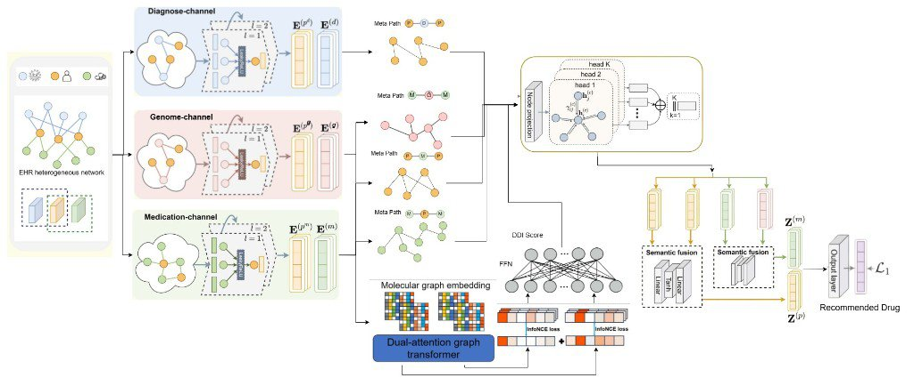
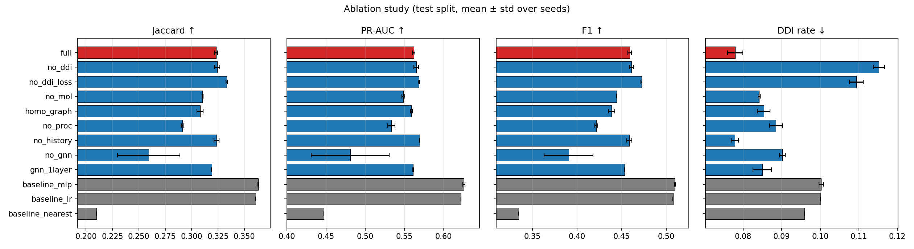
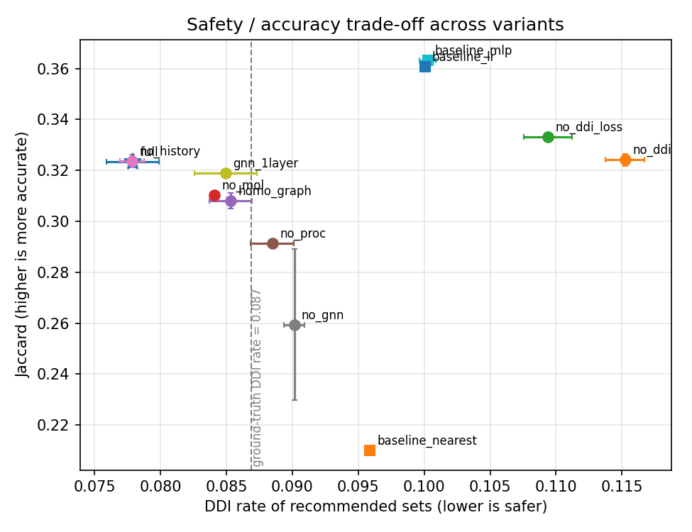
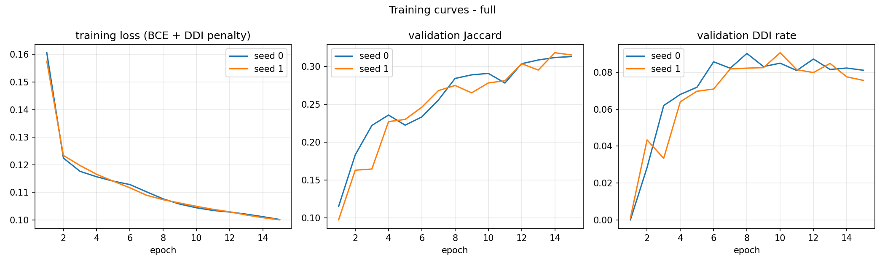

# GRAND / HGDR — Personalized medication recommendation (Phase 2)

**Official project title (AUIST cover, May 2025):**
*GRAND: Graph-based Recommendation with Attention Network for Personalized Drug Therapy.*

**Author:** Ashwin Prabhu M (Register No. **2023176029**), M.Tech. Information Technology
(AI & DS), Department of Information Science and Technology, College of Engineering,
Guindy, Anna University. Guide: Dr. T. Mala.

This directory is the public Phase 2 package (`hgdr`). It recommends a *set* of drugs
for a hospital admission while penalising known drug–drug interactions (DDIs). The
**architecture figure below is the official thesis drawing.** The code that actually
trains and is ablated here is the **EHR + molecular + DDI subset** of that drawing —
diagnoses, procedures and drugs, not genomes, and not the Dual-attention Graph
Transformer + InfoNCE DDI head. See
[Thesis architecture vs. released implementation](#thesis-architecture-vs-released-implementation)
and [`docs/thesis_notes.md`](docs/thesis_notes.md).

Phase 1 (`../phase1/`, KIBA drug–target affinity) is a separate package
from the December 2024 AUIST DTI / graph-transformer report.
**University AUIST Phase-I report (GRAND) ↔ this folder (`phase2/`).**

<p align="center">
  
  <br><em>Official architecture. Left: EHR heterogeneous network → Diagnose / Genome / Medication
  GCN channels (LeakyReLU) → meta-paths P–D–P, M–G–M, P–M–P, M–P–M → multi-head
  node-projection attention → semantic fusion (Linear→Tanh→Linear) → \(Z^{(m)}, Z^{(p)}\)
  → recommended drug with \(\mathcal{L}_1\). Bottom: Dual-attention Graph Transformer
  on molecular graphs with InfoNCE → FFN → DDI score. The released <code>hgdr</code> model
  trains the EHR+DDI subset of this figure (no genome channel, no InfoNCE DAGT head).</em>
</p>

---

## Contents

1. [Problem formulation](#1-problem-formulation)
2. [Thesis architecture vs. released implementation](#thesis-architecture-vs-released-implementation)
3. [Datasets and licensing](#2-datasets-and-licensing)
4. [Installation](#3-installation)
5. [Quick start](#4-quick-start)
6. [Results](#5-results)
7. [Ablation study](#6-ablation-study)
8. [Hyper-parameters](#7-hyper-parameters)
9. [Project structure](#8-project-structure)
10. [Reproducibility notes](#9-reproducibility-notes)
11. [Changes w.r.t. the research code](#10-changes-wrt-the-research-code)
12. [Citation, licence, acknowledgements](#11-citation-licence-acknowledgements)

---

## 1. Problem formulation

For patient \(p\) with admissions \(v_1, \dots, v_T\), each admission \(v_t\) has a set of
diagnosis codes \(D_t\), procedure codes \(P_t\) and prescribed drugs \(M_t \subseteq \mathcal{M}\)
(\(|\mathcal{M}| = 606\) normalised drug names on MIMIC-III). HGDR predicts

\[
\hat{y}_t = \sigma\big(f_\theta(D_t, P_t, \{(D_\tau, P_\tau, M_\tau)\}_{\tau < t};\, \mathcal{G})\big) \in [0, 1]^{|\mathcal{M}|}
\]

and recommends \(\hat{M}_t = \{ m : \hat{y}_{t,m} > 0.5 \}\). \(\mathcal{G}\) is the released
heterogeneous entity graph (diagnoses, procedures, drugs — the EHR+DDI subset of
the official figure). Training minimises

\[
\mathcal{L} = \mathrm{BCE}(y_t, \hat{y}_t) + \lambda \cdot
\frac{\hat{y}_t^{\top} A_{\text{DDI}} \hat{y}_t}{\sum_{i \neq j} \hat{y}_{t,i}\hat{y}_{t,j}},
\]

where the second term is the expected fraction of recommended drug pairs that interact
(a differentiable surrogate of the DDI-rate metric; see `src/hgdr/models/losses.py`).
This is the standard *multi-label, admission-level medication recommendation with DDI control*
setting of GAMENet / SafeDrug, evaluated with **Jaccard, PR-AUC, F1, DDI rate and average
number of recommended drugs**, plus the ranking metrics the original notebooks reported
(Precision@10, Jaccard@10, HitRate@10).

The official figure labels the recommendation objective \(\mathcal{L}_1\). In this
release \(\mathcal{L}_1\) is the BCE + soft-DDI-rate sum above — not an L1/MAE
regression, and not the report’s substitute-ranking score
\(\mathrm{cosine}-\lambda\rho\).

## Thesis architecture vs. released implementation

The May 2025 AUIST report and the official figure propose a two-branch system
(HAN-style EHR channels + Dual-attention Graph Transformer DDI). `hgdr` is the
piece that was actually trained on the credentialed MIMIC-III copy available for
this work. **This README does not claim the package implements the full figure.**

| Thesis component (figure / Ch. 3–4) | In `hgdr`? | What shipped |
|---|---|---|
| EHR nodes: patients, diagnoses, medications | partial | **diag / proc / drug** entity graph; patients are *examples*, not nodes |
| **Genome channel** and meta-path **M–G–M** | **no** | Thesis-proposed / optional. MIMIC-III has no genome table in this release |
| Diagnose / medication GCN channels, LeakyReLU | partial | `HeteroConv` + SAGE/GAT, residual + LayerNorm + ReLU (2 layers) |
| Meta-paths **P–D–P**, **P–M–P**, **M–P–M** | partial | Training-only diag–drug, proc–drug, drug–drug co-prescription + TWOSIDES `interacts`. No explicit HAN meta-path adjacency (the research `DRecHGR/` used P–D–P / P–M–P graphs) |
| Multi-head node-projection attention | partial | Optional GAT heads inside `HeteroConv`; default encoder is SAGE |
| Semantic fusion Linear→Tanh→Linear | partial | Same MLP is the **admission-code attention pool**, *not* HAN semantic attention over meta-path embeddings \(Z^{(m)}, Z^{(p)}\) |
| Dual-attention Graph Transformer + **InfoNCE** DDI branch | **no** | `MolEncoder` is a 2-layer GAT/GIN on packed SMILES graphs; DDI is the soft-rate **penalty**, not pairwise InfoNCE. DrugDAGT remains in the research `dagt/` tree only |
| Clinical-notes NLP / BERT (report §3.2.1, §4.2.2) | **no** | Structured ICD / procedure / drug codes only |
| FDA / DailyMed substitute APIs (report §3.1.3, §4.3) | **no** | Not required for the GAMENet-style multi-label task |
| LightGCN patient embedding + cosine ranker (report §4.3.4–4.3.6) | **no** | Bilinear \(qK^\top/\sqrt{d}\) over the 606-drug vocabulary |
| Report Tables 4.1–4.2 (DDI MAE 0.25, substitute Jaccard 0.967) | **not reproduced** | Different task. Released numbers: subset Jaccard **0.3233** / DDI **0.0779**; full-data Jaccard **0.3561** / DDI **0.0724** |

**Released model in one sentence.** Diagnoses + procedures + drugs + PubChem
molecules + TWOSIDES DDI, trained as multi-label admission recommendation —
the EHR+DDI subset the ablation already measured. Genomes, InfoNCE, DAGT,
BERT notes, and substitute APIs stay documented as thesis-proposed.

Chapter-level mapping: [`docs/thesis_notes.md`](docs/thesis_notes.md).

## 2. Datasets and licensing

| dataset | role | licence | shipped here? |
|---|---|---|---|
| **MIMIC-III v1.4** ([PhysioNet](https://physionet.org/content/mimiciii/1.4/)) | admissions, diagnoses, procedures, prescriptions | credentialed DUA - **must not be redistributed** | **no** - rebuilt locally by `scripts/preprocess_mimic.py` |
| **MIMIC-III demo v1.4** ([PhysioNet](https://physionet.org/content/mimiciii-demo/1.4/)) | 100-patient smoke test | ODbL 1.0 | no - downloaded by `scripts/demo_mode.ps1` |
| **TWOSIDES** (Tatonetti et al. 2012) | DDI pairs | open | derived 0.7 MB CID-pair table in `data/mappings/` |
| **PubChem** | drug name -> CID -> SMILES | open | 0.1 MB mapping in `data/mappings/` |
| **Genomes** (official figure) | medication–genome channel / M–G–M | — | **not available** in the MIMIC-III extract used here; not trained |

See [`data/README.md`](data/README.md) for access instructions, table requirements, and the
list of research artefacts that were deliberately *not* included (everything patient-level).
The report also names FDA / DailyMed APIs and BERT-encoded clinical notes; those
inputs are **not** part of this release.

## 3. Installation

Python 3.12, PyTorch 2.5.1 (CUDA 12.1 or CPU), PyTorch Geometric 2.6.1, RDKit.
Windows PowerShell is shown; the same commands work in bash with `/` paths.

```powershell
cd phase2
python -m venv .venv                       # any Python >= 3.10 works
.\.venv\Scripts\Activate.ps1
pip install torch==2.5.1 --index-url https://download.pytorch.org/whl/cu121   # or plain `pip install torch==2.5.1` for CPU
pip install -r requirements.txt
python -m pytest -q                        # 34 tests, ~15-30 s on CPU
```

`torch_scatter` / `torch_sparse` are **not** required (PyG falls back to native
`torch.scatter_reduce`). DGL is not used - see [Section 10](#10-changes-wrt-the-research-code).

## 4. Quick start

### 4.1 Demo mode (no credentials, ~3-5 min)

```powershell
powershell -ExecutionPolicy Bypass -File scripts/demo_mode.ps1
```

Downloads the public MIMIC-III demo, preprocesses it, builds the graph, trains the full model,
runs a 4-variant mini-ablation, makes the figures and runs the tests. Output goes to the
git-ignored `results_demo/`. Numbers on 100 patients are *not* meaningful.

### 4.2 Full pipeline on your MIMIC-III copy

```powershell
# 0. (optional) junction your local copy into data/raw/ - nothing is copied
powershell -File scripts/link_local_data.ps1 -MimicDir "D:\data\mimic-iii-clinical-database-1.4" -TwosidesCsv "D:\data\twosides.csv"

# 1. MIMIC-III -> admission records + vocabularies          (~4 min, chunked, < 3 GB RAM)
python scripts/preprocess_mimic.py --mimic_dir data/raw/mimic-iii --out data/processed/mimic3

# 2. (optional) rebuild the TWOSIDES CID-pair table from the 660 MB source  (~1 min)
python scripts/build_ddi_graph.py --twosides data/raw/twosides.csv --top_k 40

# 3. (optional) extend the PubChem mapping for unmapped names (network)   (~5 min)
python scripts/build_drug_mapping.py --processed_dir data/processed/mimic3 --online

# 4. heterogeneous graph + DDI adjacency + molecular graphs  (~1.5 min)
python scripts/build_hetero_graph.py --processed_dir data/processed/mimic3

# 5. train + evaluate one configuration
python scripts/train.py --config configs/ablation_base.yaml --seed 0      # 30 % subset protocol (~5 min on a GTX 1650 Ti)
python scripts/train.py --config configs/default.yaml --seed 0            # full data, 30 epochs (~12 min on a GTX 1650 Ti; see Section 5.1)
python scripts/train.py --config configs/default.yaml --set train.epochs=5 model.hidden_dim=32   # any override

# 6. evaluate a checkpoint (keep_checkpoint: true in the config, or scripts/train.py)
python scripts/evaluate.py --config results/runs/full_seed0/config.yaml --checkpoint results/runs/full_seed0/best.pt

# 7. ablation study (12 variants x 2 seeds, one run at a time, resumable) -> results/ablation_results.csv, ablation_table.md
python scripts/run_ablation.py --seeds 0 1
#    detached on Windows (survives a closed terminal):
#    Start-Process -FilePath .\.venv\Scripts\python.exe -ArgumentList '-u','scripts/run_ablation.py','--seeds','0','1' `
#        -RedirectStandardOutput results/ablation_stdout.log -RedirectStandardError results/ablation_stderr.log -WindowStyle Hidden

# 8. figures -> results/figures/
python scripts/make_figures.py
```

Every run writes `results/runs/<name>_seed<k>/{config.yaml, history.csv, metrics.json, train.log, best.pt}`
(`best.pt` is git-ignored; `run_ablation.py` deletes checkpoints to save space). `run_ablation.py`
skips every run that already has a `metrics.json`, rewrites `results/ablation_results.csv` after each
finished run and continues past a crashed run, so an interrupted study is resumed by re-issuing the
same command; `--summary_only` rebuilds the table from whatever runs exist.

## 5. Results

Full local MIMIC-III subset available for this work: **39,239 patients / 50,085 admissions**,
3,868 diagnosis codes, 115 procedure items (`PROCEDUREEVENTS_MV`), 606 drugs (521 with SMILES,
8,933 TWOSIDES DDI pairs among them), 26.1 drugs per admission, ground-truth DDI rate 0.085.
Patient-level hash split 80/10/10.

All numbers below were produced by `python scripts/run_ablation.py --seeds 0 1` under the
**subset protocol of Section 6** (30 % of patients, <= 15 epochs, 2 seeds, test split of 1,485
admissions, threshold 0.5). Mean ± std over the two seeds; source: `results/ablation_results.csv`.

| model | Jaccard ↑ | PR-AUC ↑ | F1 ↑ | DDI rate ↓ | #drugs | P@10 ↑ | Jaccard@10 ↑ | HitRate@10 ↑ | params | min/run |
|---|---:|---:|---:|---:|---:|---:|---:|---:|---:|---:|
| **HGDR (full)** | 0.3233 ± 0.0013 | 0.5621 ± 0.0016 | 0.4590 ± 0.0020 | **0.0779 ± 0.0020** | 15.07 | 0.676 | 0.239 | 0.991 | 0.49 M | 4.2 |
| MLP on multi-hot codes | **0.3633 ± 0.0004** | **0.6261 ± 0.0012** | **0.5097 ± 0.0003** | 0.1003 ± 0.0006 | 15.15 | 0.731 | 0.267 | 0.995 | 1.33 M | 1.5 |
| logistic regression on multi-hot codes | 0.3608 ± 0.0001 | 0.6224 ± 0.0001 | 0.5076 ± 0.0001 | 0.1000 ± 0.0000 | 14.78 | 0.729 | 0.267 | 0.997 | 2.78 M | 1.6 |
| copy previous admission | 0.2100 | 0.4474 | 0.3348 | 0.0959 | 12.44 | 0.578 | 0.192 | 0.939 | 0 | 0.2 |
| *ground-truth prescriptions* | – | – | – | 0.0869 | 26.1 | – | – | – | – | – |

**What the table says.** Under this budget-limited protocol HGDR is the *safest* recommender - its
DDI rate (0.078) is below the DDI rate of the real prescriptions (0.087) and 22 % below the
multi-hot baselines (0.100) - but the multi-hot MLP / logistic regression are *more accurate*
(+0.04 Jaccard, +0.06 PR-AUC). Two reasons are visible in the logs: (i) the GNN variants were
still improving at the 15-epoch cap (best epoch = 14-15 for every `full` seed; the 20-epoch runs
of the same config reached 0.326-0.345 test Jaccard), whereas the linear/MLP baselines converge in
~10 epochs; (ii) the DDI penalty costs accuracy (`no_ddi_loss` in Section 6 is +0.010 Jaccard at
+0.032 DDI rate). A later full-data run of `configs/default.yaml` (seed 0) is in Section 5.1:
Jaccard rose to 0.356 and DDI fell to 0.072. That still does not overtake the *subset* MLP
(Jaccard 0.363); the MLP was not re-run on full data.

Absolute numbers are **not** directly comparable to GAMENet/SafeDrug (131 ATC-3 classes,
>= 2-visit patients); `results/baseline_comparison.md` explains the protocol differences and
lists the literature numbers (marked *reported, not re-run*).

They are also **not** comparable to AUIST report Tables 4.1–4.2 (DDI MAE ≈ 0.25,
substitute-list Jaccard 0.967). Those evaluate a pairwise DDI regressor and a
substitute-retrieval ranker. See [`docs/thesis_notes.md`](docs/thesis_notes.md).

### 5.1 Full-data run (seed 0)

`python scripts/train.py --config configs/default.yaml --seed 0` on all 39,239 patients /
50,085 admissions (31,268 / 3,961 / 4,010 train/val/test patients; 39,992 / 5,032 / 5,061
visits). Same 493 k model, batch 128, lr 1e-3, ≤ 30 epochs, early stopping patience 5 on
validation Jaccard. One seed. Source: `results/fulldata_full_seed0_summary.md` and
`results/runs/fulldata_full_seed0/metrics.json`. This does **not** replace the subset
ablation directories (`results/runs/full_seed0`, `full_seed1`).

| model | Jaccard ↑ | PR-AUC ↑ | F1 ↑ | DDI rate ↓ | #drugs | P@10 ↑ | best epoch | min |
|---|---:|---:|---:|---:|---:|---:|---:|---:|
| **HGDR (full data, seed 0)** | 0.3561 | 0.6033 | 0.4969 | **0.0724** | 15.54 | 0.7065 | 19 | 12.3 |
| HGDR (30 % subset, 2-seed mean) | 0.3233 ± 0.0013 | 0.5621 ± 0.0016 | 0.4590 ± 0.0020 | 0.0779 ± 0.0020 | 15.07 | 0.676 | 14–15 | 4.2 |
| MLP (30 % subset, 2-seed mean) | 0.3633 ± 0.0004 | 0.6261 ± 0.0012 | 0.5097 ± 0.0003 | 0.1003 ± 0.0006 | 15.15 | 0.731 | ~10 | 1.5 |
| *ground-truth test prescriptions* | – | – | – | 0.0866 | – | – | – | – |

Early-stopped at epoch 24 (no val improvement for 5 epochs after the best checkpoint at
epoch 19). Wall-clock 12.3 min on a GTX 1650 Ti (~24–42 s/epoch). Full-data training
closed most of the subset-protocol accuracy gap (+0.033 Jaccard vs subset HGDR) and
lowered DDI further (0.072 vs 0.078, still below the 0.087 of real prescriptions). It
did **not** overtake the published subset MLP (0.356 vs 0.363). The MLP was not re-run
on full data, so that last comparison is across protocols.

## 6. Ablation study

Protocol (`configs/ablation_base.yaml`, identical for **every** row including `full`):

* data: a fixed, hash-selected **30 % of patients** (`md5("subset0:" + subject_id) < 0.3`):
  9,349 / 1,182 / 1,196 train/val/test patients = **11,954 / 1,471 / 1,485 admissions**,
  patient-level 80/10/10 split with `split_seed = 0`; the same admissions for every variant and seed;
* training: at most **15 epochs**, early stopping on validation Jaccard (patience 4, min 3 epochs),
  batch 256, AdamW lr 2e-3, weight decay 1e-5, grad-clip 1.0, ReduceLROnPlateau; the checkpoint with the
  best validation Jaccard is evaluated on the test admissions;
* **2 seeds (0, 1)** per variant, baselines included; only the initialisation and batch order change with the seed;
* one run at a time on a shared 4 GB GTX 1650 Ti; runtime per run is stored in `metrics.json`
  (`runtime_s`, includes data loading and the final evaluation).

The 15-epoch cap was chosen so that the whole study (24 runs) fits into a ~3 h wall-clock budget
on the shared GPU (it took 68 min with the GPU otherwise idle). Two earlier 20-epoch `full` runs of
the same configuration reached 0.326 / 0.345 test Jaccard (best epochs 18 / 19) versus 0.322 / 0.325
here, so the GNN variants are slightly under-trained under the cap; the ranking of the variants is
what this table is for, not the absolute optimum of each.

Test split, mean ± std over seeds 0 and 1 (`results/ablation_table.md`, generated by `run_ablation.py`;
ground-truth DDI rate of the test prescriptions 0.0869). Runtime = wall-clock per run incl. data loading
and evaluation, GTX 1650 Ti.

| Variant | Description | Jaccard ↑ | PR-AUC ↑ | F1 ↑ | DDI rate ↓ | #drugs | Runtime (min) | Seeds |
|---|---|---:|---:|---:|---:|---:|---:|---:|
| `full` | HGDR (full model) | 0.3233 ± 0.0013 | 0.5621 ± 0.0016 | 0.4590 ± 0.0020 | 0.0779 ± 0.0020 | 15.07 ± 0.20 | 4.2 | 2 |
| `no_ddi` | - DDI edges & DDI loss | 0.3242 ± 0.0024 | 0.5654 ± 0.0030 | 0.4611 ± 0.0023 | 0.1152 ± 0.0015 | 14.83 ± 0.16 | 4.3 | 2 |
| `no_ddi_loss` | - DDI loss (edges kept) | 0.3331 ± 0.0007 | 0.5687 ± 0.0009 | 0.4722 ± 0.0006 | 0.1094 ± 0.0018 | 15.74 ± 0.20 | 4.3 | 2 |
| `no_mol` | - molecular (SMILES) drug encoder | 0.3104 ± 0.0005 | 0.5488 ± 0.0017 | 0.4444 ± 0.0001 | 0.0841 ± 0.0003 | 14.08 ± 0.21 | 3.5 | 2 |
| `homo_graph` | homogeneous graph (types collapsed) | 0.3081 ± 0.0030 | 0.5592 ± 0.0011 | 0.4389 ± 0.0036 | 0.0853 ± 0.0016 | 13.90 ± 0.52 | 3.4 | 2 |
| `no_proc` | - procedure nodes | 0.2914 ± 0.0006 | 0.5336 ± 0.0047 | 0.4216 ± 0.0015 | 0.0885 ± 0.0016 | 13.48 ± 0.10 | 2.8 | 2 |
| `no_history` | - visit-history GRU | 0.3237 ± 0.0024 | 0.5695 ± 0.0003 | 0.4585 ± 0.0029 | 0.0778 ± 0.0009 | 14.68 ± 0.18 | 2.4 | 2 |
| `no_gnn` | - graph message passing (0 layers) | 0.2594 ± 0.0297 | 0.4811 ± 0.0498 | 0.3906 ± 0.0273 | 0.0901 ± 0.0008 | 13.01 ± 0.46 | 2.2 | 2 |
| `gnn_1layer` | 1 GNN layer (instead of 2) | 0.3190 ± 0.0001 | 0.5616 ± 0.0007 | 0.4535 ± 0.0003 | 0.0850 ± 0.0024 | 14.55 ± 0.19 | 3.6 | 2 |
| `baseline_mlp` | MLP on multi-hot codes | 0.3633 ± 0.0004 | 0.6261 ± 0.0012 | 0.5097 ± 0.0003 | 0.1003 ± 0.0006 | 15.15 ± 0.02 | 1.5 | 2 |
| `baseline_lr` | logistic regression on multi-hot codes | 0.3608 ± 0.0001 | 0.6224 ± 0.0001 | 0.5076 ± 0.0001 | 0.1000 ± 0.0000 | 14.78 ± 0.00 | 1.6 | 2 |
| `baseline_nearest` | copy previous admission | 0.2100 ± 0.0000 | 0.4474 ± 0.0000 | 0.3348 ± 0.0000 | 0.0959 ± 0.0000 | 12.44 ± 0.00 | 0.2 | 2 |

Whole study: 24 runs, 68 min of GPU time (sequential), launched once as a detached process.

<p align="center">
  
</p>
<p align="center">
  
  
</p>

**Findings** (differences are w.r.t. `full`; the seed std is <= 0.003 Jaccard for every variant
except `no_gnn`, so differences >= 0.01 are meaningful, smaller ones are not):

1. **The DDI machinery does what it is meant to do.** Removing the DDI loss raises the DDI rate of
   the recommendations from 0.078 to 0.109 (+40 %), removing DDI edges as well to 0.115 (+48 %) -
   both far above the 0.087 of the real prescriptions - for a gain of only +0.001 to +0.010 Jaccard.
   Every variant that keeps the DDI loss stays close to or below the ground-truth rate
   (0.078-0.090); `full` and `no_history` are the safest (0.078). The DDI edges alone have a small
   protective effect (0.109 vs 0.115).
2. **Graph message passing is the single most important component.** Without it (`no_gnn`) Jaccard
   drops by 0.064 and PR-AUC by 0.081; one of the two seeds collapsed after epoch 1 (best epoch 1,
   early-stopped at epoch 5), hence the large std - the graph encoder also stabilises training.
   One layer instead of two costs only 0.004 Jaccard, so most of the benefit comes from the first hop.
3. **Heterogeneity and molecular features help modestly.** Collapsing the node/edge types into one
   homogeneous graph costs 0.015 Jaccard and 0.020 F1; dropping the SMILES encoder costs 0.013 Jaccard
   and 0.013 PR-AUC. Both also raise the DDI rate slightly (0.084-0.085 vs 0.078).
4. **Procedure nodes matter more than expected** (-0.032 Jaccard, -0.029 PR-AUC without them), even
   though only MetaVision admissions have procedure items in this copy of MIMIC-III.
5. **The visit-history GRU does not help here** (+0.000 Jaccard, +0.007 PR-AUC, same DDI rate, 40 %
   less runtime without it). 83 % of the patients in this cohort have a single admission and 78 % of
   all admissions are first admissions, so the history is empty for most training examples - on a
   >= 2-visit cohort (the GAMENet/SafeDrug protocol) this component should be re-evaluated.
6. **Multi-hot baselines are the accuracy reference to beat** (see Section 5): they win on every
   accuracy metric under this 15-epoch protocol while being the least safe learned models
   (DDI rate 0.100). The `copy previous admission` heuristic is far below everything else.

## 7. Hyper-parameters

| group | value (`configs/default.yaml`) |
|---|---|
| embedding / hidden size | 64 |
| graph encoder | `HeteroConv` with `SAGEConv` per relation, 2 layers, LayerNorm + residual, dropout 0.2 (`homo` variant: single shared `SAGEConv`) |
| molecular encoder | 2-layer GAT (4 heads) on RDKit atom features (element, degree, charge, hybridisation, aromaticity, #H), mean pooling, sigmoid gate into the drug embedding |
| admission encoder | additive attention pooling over diagnosis and procedure embeddings; history GRU (hidden 64) over the last 10 admissions (codes + prescribed drugs) |
| scoring | \(q K^\top / \sqrt{d}\) + per-drug bias, sigmoid, threshold 0.5 |
| loss | BCE + 0.05 x soft-DDI-rate |
| optimiser | AdamW, lr 1e-3 (2e-3 in the subset protocol), weight decay 1e-5, grad-clip 1.0, ReduceLROnPlateau(x0.5) |
| epochs / early stopping | 30 / patience 5 on validation Jaccard, min 3 epochs (15 / 4 in the subset protocol) |
| batch size | 128 (256 in the subset protocol) |
| graph construction | diag-drug and proc-drug edges: co-occurrence >= 5 in training admissions, top-20 per source node; drug-drug co-prescription: >= 5, top-20; DDI edges: TWOSIDES top-40 side effects |
| vocabulary filters | drug >= 50 admissions, diagnosis >= 5, procedure >= 5 |
| split | `md5(split_seed:subject_id)` 80/10/10 by patient, `split_seed = 0` |

## 8. Project structure

```
phase2/
├── README.md, CHANGELOG.md, requirements.txt, environment.yml, pytest.ini, .gitignore
├── configs/            default.yaml (full model, full data) - ablation_base.yaml (subset protocol)
│                       ablation_*.yaml (one per component) - baseline_*.yaml - demo.yaml
├── src/hgdr/           importable package
│   ├── config.py       YAML inheritance + dotted CLI overrides
│   ├── data/           mimic.py (chunked preprocessing), drug_mapping.py (name normalisation, PubChem),
│   │                   ddi.py (TWOSIDES), graph.py (hetero graph + RDKit molecules), splits.py, dataset.py
│   ├── models/         recommender.py (HGDR), hetero_gnn.py, mol_encoder.py, losses.py, baselines.py, factory.py
│   ├── utils/          seed.py, logging.py, metrics.py
│   ├── train.py        run_experiment(): training loop, early stopping, CPU fallback on CUDA OOM
│   └── evaluate.py     evaluate_checkpoint()
├── scripts/            preprocess_mimic.py, build_ddi_graph.py, build_drug_mapping.py, build_hetero_graph.py,
│                       train.py, evaluate.py, run_ablation.py, make_figures.py, demo_mode.ps1, link_local_data.ps1
├── data/               README.md + mappings/ (shippable, non-patient); raw/ and processed/ are git-ignored
├── results/            ablation_results.csv, ablation_summary.csv, ablation_table.md, baseline_comparison.md,
│                       fulldata_full_seed0_summary.md, figures/, runs/<run>/ (metrics.json, history.csv, config.yaml)
├── docs/               thesis_notes.md (AUIST report summary) + figures/
│                       architecture_final.jpg (official thesis figure) + architecture.png
├── notebooks/          demo_walkthrough.ipynb (outputs stripped)
└── tests/              34 pytest cases (synthetic graph + synthetic MIMIC-shaped sample; < 1 min CPU)
```

## 9. Reproducibility notes

* **Seeds.** `hgdr.utils.set_seed(seed)` seeds Python, NumPy and PyTorch (CPU + CUDA) and enables
  deterministic cuDNN. PyG scatter/aggregation kernels on CUDA are *not* bit-deterministic, so
  repeated runs with the same seed differ in the 3rd-4th decimal; the reported std over seeds
  dominates this.
* **Splits.** Patient assignment is `md5(f"{split_seed}:{subject_id}")`, so the split is
  reproducible from the raw data without shipping any IDs. The subset protocol uses
  `md5(f"subset{subset_seed}:{subject_id}") < subset_fraction`.
* **Hardware used.** NVIDIA GTX 1650 Ti (4 GB), 16 GB RAM, Windows 10/11, GPU shared with an
  unrelated training job. Peak GPU memory of the full model: ~1.4 GB (batch 256, including the
  molecular graphs). A subset-protocol epoch takes 11-20 s when the GPU is free (up to 80-200 s when
  another job shares it); a full-data epoch 24-42 s when the GPU is free. `train.py` automatically retries on CPU if CUDA
  runs out of memory. See Section 6 for the measured per-run times.
* **Full-scale run.** `configs/default.yaml` (all 50,085 admissions, ≤ 30 epochs, patience 5)
  completed 2026-09-17, seed 0: early stop at epoch 24 (best epoch 19), **12.3 min** on a
  GTX 1650 Ti. Test Jaccard **0.3561**, PR-AUC **0.6033**, F1 **0.4969**, DDI rate **0.0724**,
  15.54 drugs/admission. Write-up: `results/fulldata_full_seed0_summary.md`. Reproduce with
  `python scripts/train.py --config configs/default.yaml --seed 0`.
* **Data versions.** MIMIC-III v1.4 tables as listed in `data/README.md`; the local copy lacked
  `PROCEDURES_ICD`, so procedure nodes are `PROCEDUREEVENTS_MV` item ids (MetaVision admissions
  only). With `PROCEDURES_ICD` present the code uses ICD-9 procedures automatically.
* **Environment.** Exact versions in `requirements.txt`; the runs reported here used
  `torch 2.5.1+cu121`, `torch-geometric 2.6.1`, `rdkit 2024.03.5`, `numpy 1.26.4`, `pandas 2.2.3`.
* **Checkpoints** are not distributed (they are trained on credentialed data); every number in
  `results/` is reproducible with the commands in Section 4.

## 10. Changes w.r.t. the research code

See [`CHANGELOG.md`](CHANGELOG.md) for the full list. Highlights:

* One package instead of ~12 notebook variants; every component is a config flag.
* Preprocessing rebuilt from raw MIMIC tables in chunks (no 17 GB merged CSV), drug names
  normalised to active ingredients, training-only graph edges (no label leakage),
  admission-level (not patient-level) evaluation.
* **DGL -> PyTorch Geometric.** DGL wheels for torch 2.5 / CUDA 12.1 / Windows were not
  available. The HAN/GAT encoder of **DRecHGR** (P–D–P / P–M–P meta-path graphs +
  Linear–Tanh–Linear semantic attention) was **not** ported 1:1; the release uses PyG
  `HeteroConv` over a diag/proc/drug entity graph. That is an intentional
  simplification — see the [gap table](#thesis-architecture-vs-released-implementation).
  `torch_scatter` is avoided on purpose (ABI-incompatible wheel).
* DDI handling moved from a post-hoc filter / pairwise DrugDAGT score into a
  differentiable soft-DDI-rate loss. The official figure’s Dual-attention Graph
  Transformer + InfoNCE branch is **not** in `hgdr` (`MolEncoder` is GAT/GIN).
* PubChem API field rename (`CanonicalSMILES` -> `SMILES`) fixed; an `index_put`-based
  gather that made the backward pass 8x slower on CUDA replaced by `F.embedding`.

## 11. Citation, licence, acknowledgements

Primary source for this package: the **May 2025** GRAND report.
The BibTeX `note` keeps the university wording (“AUIST Phase-I”);
**University AUIST Phase-I report (GRAND) ↔ repository folder `phase2/`**.
The earlier DTI / graph-transformer report is cited under
[`../phase1/`](../phase1/README.md). Both entries:
[`../CITATIONS.bib`](../CITATIONS.bib).

```bibtex
@mastersthesis{prabhu2025grand,
  author  = {Ashwin Prabhu M},
  title   = {GRAND: Graph-based Recommendation with Attention Network
             for Personalized Drug Therapy},
  school  = {Department of Information Science and Technology,
             College of Engineering, Guindy, Anna University},
  year    = {2025},
  note    = {M.Tech. (Information Technology -- AI \& DS) AUIST Phase-I
             project report, Register No. 2023176029. Supervisor: Dr. T. Mala},
  url     = {https://github.com/BlackAsh01/graph-drug-discovery}
}
```

An alternate title on the report’s bona fide certificate is *Graph Transformer
Based Personalized Drug Recommendation System for Cardiovascular Disease*.
That wording is also the **cover title** of the December 2024 Phase 1 DTI report.

**Licence.** Source code: MIT (see the repository root). Data: MIMIC-III is governed by the
PhysioNet DUA and is not included; TWOSIDES / PubChem derived tables in `data/mappings/` are
redistributed under their original open terms.

**Acknowledgements / adapted work.**
* AUIST report acknowledgements: Dr. T. Mala (guide); Dr. S. Swamynathan (HOD);
  committee Dr. S. Sridhar, Dr. G. Geetha, Dr. D. Narashiman; IST faculty and staff,
  College of Engineering, Guindy, Anna University.
* Task definition and the TWOSIDES top-40 convention follow **GAMENet**
  (Shang et al., AAAI 2019) and **SafeDrug** (Yang et al., IJCAI 2021).
* Heterogeneous attention / meta-paths in the official figure follow the research
  **DRecHGR** notebooks (DGL/HAN). Semantic fusion Linear→Tanh→Linear is reused
  here as admission-code pooling.
* The molecular Dual-attention Graph Transformer + contrastive (InfoNCE) branch
  follows **DrugDAGT** (Chen et al., *BMC Biology* 2024); it is cited, not vendored
  into `hgdr`.
* MIMIC-III: Johnson et al., *Sci. Data* 2016. TWOSIDES: Tatonetti et al., *Sci. Transl. Med.* 2012.
  PubChem: Kim et al., *Nucleic Acids Res.* 2023. RDKit, PyTorch, PyTorch Geometric.
